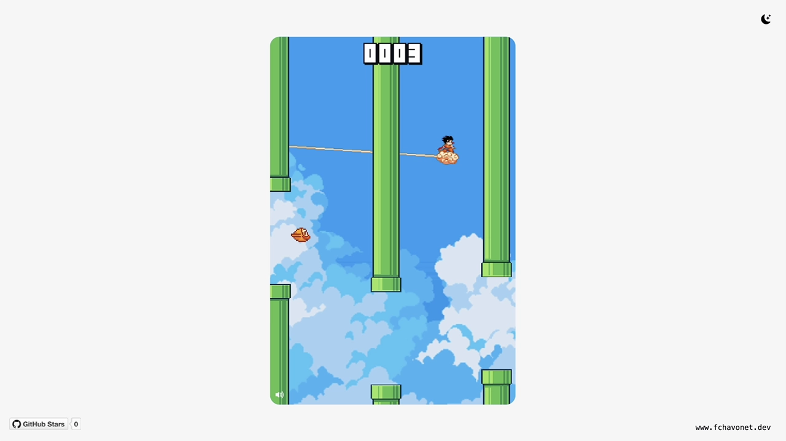

# Flappy Bird Clone

## Description

This is a clone of the famous Flappy Bird game, built from scratch in two days using vanilla HTML, CSS, and JavaScript.

This project was both a fun challenge and a great opportunity to explore fundamental game development concepts such as canvas layering, sprite animation, collision detection, parallax scrolling, audio control, and state persistence via `localStorage`.

It’s a compact and approachable example, ideal for understanding how a browser game is structured and functions.

## Objectives

- Recreate a Flappy Bird experience using vanilla HTML, CSS, and JavaScript.
- Manage multiple canvas layers (UI, game, background).
- Implement gravity, jump mechanics, obstacles, and collision detection.
- Store best scores using localStorage.
- Use parallax scrolling to create background depth.
- Add sound management (toggleable) and keyboard controls.

## Tech Stack


## File Description

| **FILE**     | **DESCRIPTION**                                                |
| :----------: | -------------------------------------------------------------- |
| `assets`     | Contains the resources required for the repository.            |
| `index.html` | Main HTML structure for the project.                           |
| `style.css`  | Styles and animations for the project.                         |
| `script.js`  | Main JavaScript file handling gameplay logic and interactions. |
| `README.md`  | The README file you are currently reading 😉.                  |

## Assets

<table align="center">
  <tr>
    <td align="center">
      <a href="https://megacrash.itch.io/flappy-bird-assets" target="_blank">
        
      </a>
      <br>
      By <a href="https://megacrash.itch.io" target="_blank">Juan Camilo</a> from 
      <a href="https://itch.io/" target="_blank">itch.io</a>
    </td>
    <td align="center">
      <a href="https://free-game-assets.itch.io/free-sky-with-clouds-background-pixel-art-set" target="_blank">
        
      </a>
      <br>
      By <a href="https://free-game-assets.itch.io" target="_blank">CRAFTPIX</a> from 
      <a href="https://itch.io/" target="_blank">itch.io</a>
    </td>
  </tr>
</table>

## Installation & Usage

### Installation

1. Clone this repository:
    - Open your preferred Terminal.
    - Navigate to the directory where you want to clone the repository.
    - Run the following command:

```
git clone https://github.com/fchavonet/web-flappy_bird_clone.git
```

2. Open the cloned repository.

### Usage

1. Open the `index.html` file in your web browser.

2. Press `SPACE` or the `↑` arrow key to start and flap.

3. Avoid hitting pipes or the top/bottom edges.

4. Try to beat your best score!

> 📌 You can mute the sound by pressing the `s` key on your keyboard.

You can also test the project online by clicking [here](https://fchavonet.github.io/creative_coding-flappy_bird_clone/).

<p align="center">
    <picture>
        <source media="(prefers-color-scheme: dark)" srcset="./assets/images/screenshots/desktop_page_screenshot-dark.webp">
        <source media="(prefers-color-scheme: light)" srcset="./assets/images/screenshots/desktop_page_screenshot-light.webp">
        
    </picture>
</p>

## What's Next?

- Add a global leaderboard system  
- Optimize for mobile devices with touch controls  
- Implement unlockable skins and themes

## Thanks

- Thanks to the talented artists who provide free game assets for everyone to use and learn from.

## Author(s)

**Fabien CHAVONET**
- GitHub: [@fchavonet](https://github.com/fchavonet)
